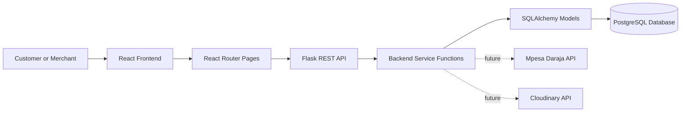
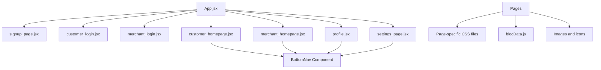
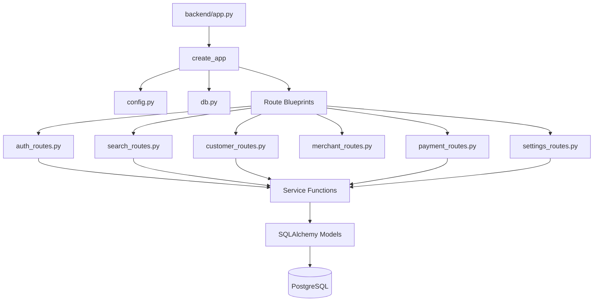
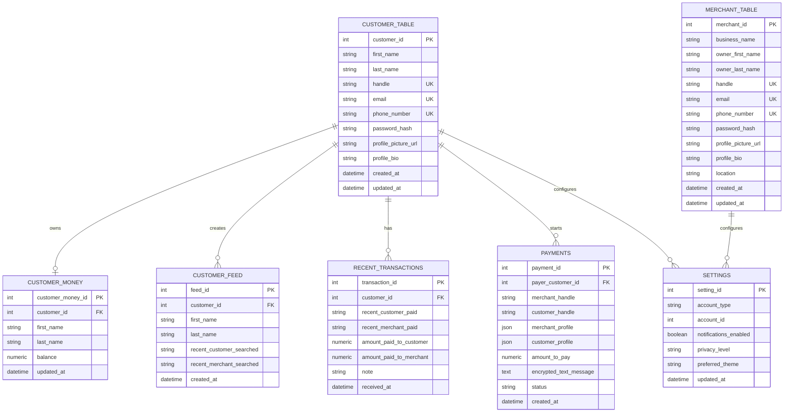
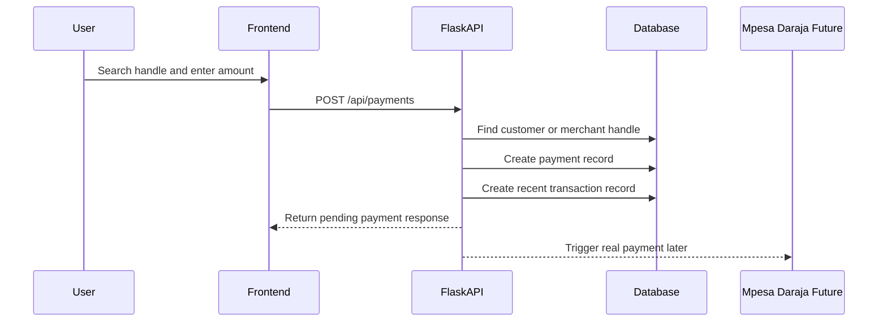
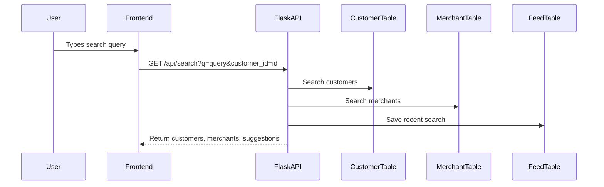

# Bloc System Integration Report Outline

## 1. Introduction

- **System name:** Bloc
- **System type:** Social-first payments web application
- **Purpose of the integration:**
  - Provide one connected platform where customers and merchants can create profiles, search by handles, view payment-related activity, and initiate payments.
  - Replace cold phone-number or Paybill-based payment flows with profile-based, handle-based, human payment interactions.
  - Prepare the application for later integration with Mpesa Daraja for real money movement and Cloudinary for profile and merchant media uploads.
- **Scope of systems involved:**
  - React frontend for user-facing pages and local UI workflows.
  - Flask backend API for authentication, search, payments, settings, and customer home data.
  - PostgreSQL database for persistent application records.
  - Future external APIs:
    - Mpesa Daraja API for top-up, send-money, and payment confirmation.
    - Cloudinary API for profile pictures, product photos, and merchant media.
- **Objectives achieved through integration:**
  - A modular frontend with separate files for pages, page-specific styles, shared data, assets, and reusable navigation components.
  - A modular backend with separate files for app setup, models, routes, services, utilities, and configuration.
  - API routes prepared for customer signup/login, merchant signup/login, search, customer homepage data, merchant profile data, payment recording, and settings.
  - Database models defined for customers, merchants, customer balances, customer feed records, recent transactions, payments, and settings.
  - A clean path for connecting frontend forms and actions to backend GET/POST endpoints.

## 2. System Overview

- **Frontend system:**
  - Built with React and Vite.
  - Uses `react-router-dom` for client-side routing.
  - Main frontend entry files:
    - `frontend/src/main.jsx`
    - `frontend/src/App.jsx`
    - `frontend/src/index.css`
  - Main frontend routes:
    - `/` renders `signup_page.jsx`
    - `/customer-login` renders `customer_login.jsx`
    - `/merchant-login` renders `merchant_login.jsx`
    - `/customer-home` renders `customer_homepage.jsx`
    - `/merchant-home` renders `merchant_homepage.jsx`
    - `/profile/:handle` renders `profile.jsx`
    - `/settings` renders `settings_page.jsx`
  - Key frontend features:
    - Signup landing page with customer and merchant entry points.
    - Customer login/signup experience with profile-card visuals and handle validation.
    - Merchant login/signup experience with business profile setup, category chips, location, hours, uploads, and payout options.
    - Customer homepage with social feed, search, balance, and recent transactions.
    - Merchant homepage with payment activity and merchant-facing profile details.
    - Profile page for customer or merchant handles.
    - Settings page for account preferences.

- **Backend system:**
  - Built with Flask.
  - Uses Flask-SQLAlchemy for ORM/database modeling.
  - Uses Flask-CORS for frontend-backend communication.
  - Uses PostgreSQL as the intended production database.
  - Backend API base URL:
    - `http://localhost:5173/`
  - Main backend files:
    - `backend/app.py`
    - `backend/app/__init__.py`
    - `backend/app/config.py`
    - `backend/app/db.py`
  - Backend route groups:
    - `auth_routes.py`
    - `customer_routes.py`
    - `merchant_routes.py`
    - `payment_routes.py`
    - `search_routes.py`
    - `settings_routes.py`
    - `health_routes.py`
  - Backend service groups:
    - `register_customer.py`
    - `register_merchant.py`
    - `search_people.py`
    - `get_customer_home.py`
    - `create_payment.py`
    - `update_settings.py`
    - Serializer functions for customer, merchant, payment, and settings payloads.

- **Database system:**
  - Intended database: PostgreSQL.
  - Database connection managed through `DATABASE_URL` in `backend/.env`.
  - Main database tables:
    - `customer_table`
    - `merchant_table`
    - `customer_money`
    - `customer_feed`
    - `recent_transactions`
    - `payments`
    - `settings`

- **Dependencies and constraints:**
  - Backend requires a running PostgreSQL database before `flask --app app.py init-db` can create tables.
  - Mpesa Daraja is not wired yet, so payments are recorded as pending external payment requests.
  - Cloudinary is not wired yet, so media uploads are represented in the UI but not stored through an external media provider.
  - Current frontend still uses local demo data in `frontend/src/data/blocData.js` until API calls are fully connected.
  - Authentication currently validates credentials but does not yet issue production sessions or JWT tokens.

## 3. Integration Architecture

- **Integration approach:**
  - API-based integration.
  - Frontend communicates with backend through REST-style HTTP endpoints.
  - Backend communicates with PostgreSQL using SQLAlchemy ORM models.
  - Future external service integrations will also be API-based:
    - Mpesa Daraja REST API.
    - Cloudinary upload API.

- **High-level architecture diagram:**

- **Frontend module architecture:**

- **Backend module architecture:**

- **Data flow: customer signup and login:**
  - Customer enters signup details on the frontend.
  - Frontend sends POST request to `/api/auth/customers/signup`.
  - Backend validates required fields.
  - Backend checks password and confirm password match.
  - Backend hashes password using Werkzeug.
  - Backend creates a `customer_table` record.
  - Backend creates a linked `customer_money` record.
  - Backend returns serialized customer data to the frontend.
  - Customer login sends POST request to `/api/auth/customers/login`.
  - Backend checks email and password hash.
  - Backend returns serialized customer data after successful login.

- **Data flow: merchant signup and login:**
  - Merchant enters business and account details on the frontend.
  - Frontend sends POST request to `/api/auth/merchants/signup`.
  - Backend validates account data.
  - Backend hashes password.
  - Backend creates a `merchant_table` record.
  - Backend returns serialized merchant data.
  - Merchant login sends POST request to `/api/auth/merchants/login`.
  - Backend validates credentials and returns merchant profile data.

- **Data flow: search:**
  - Customer types a search query in the frontend search bar.
  - Frontend sends GET request to `/api/search?q=<query>&customer_id=<id>`.
  - Backend searches both `customer_table` and `merchant_table`.
  - Backend returns matching customers, matching merchants, and combined suggestions.
  - Backend records recent customer and merchant searches in `customer_feed` when a customer ID is supplied.

- **Data flow: customer homepage:**
  - Frontend requests GET `/api/customers/<customer_id>/home`.
  - Backend fetches:
    - Customer profile.
    - Customer balance from `customer_money`.
    - Recent feed records from `customer_feed`.
    - Recent transactions from `recent_transactions`.
  - Backend returns one combined customer-home payload.

- **Data flow: payment request:**
  - User searches for a customer or merchant.
  - User enters payment amount and context message.
  - Frontend sends POST request to `/api/payments`.
  - Backend validates amount and target handle.
  - Backend resolves target profile from `customer_table` or `merchant_table`.
  - Backend stores a `payments` record with status `pending_external_payment`.
  - Backend stores a `recent_transactions` record for the payer when `payer_customer_id` is available.
  - Future Mpesa Daraja integration will trigger actual payment processing from this point.

- **Protocols used:**
  - HTTP for frontend-backend communication.
  - REST-style JSON requests and responses.
  - SQL through SQLAlchemy ORM for database access.
  - Future REST API calls to Mpesa Daraja and Cloudinary.

- **Security approach:**
  - Passwords are stored as hashes, not plain text.
  - `.env` holds local secrets and API credentials.
  - `.env.example` provides a safe template.
  - CORS is configured for frontend-backend communication.
  - Future security requirements:
    - JWT or server-side sessions.
    - Real message encryption instead of placeholder encoding.
    - Mpesa callback verification.
    - Role-based access for customer-only and merchant-only routes.

## 4. Implementation Details

- **Frontend implementation steps:**
  - Created React routes in `App.jsx`.
  - Built separate page files under `frontend/src/pages`.
  - Built separate page-specific CSS files under `frontend/src/styles`.
  - Added static assets under `frontend/src/assets`.
  - Added reusable `BottomNav` component under `frontend/src/components/BottomNav`.
  - Added local demo profiles, transactions, merchant data, and session helpers in `frontend/src/data/blocData.js`.
  - Updated signup page header to use relevant app routes:
    - Home.
    - Pay.
    - Login.
    - Merchant.
  - Added visual polish to signup profile cards:
    - Slight purple accents.
    - Rotated card orientations.
    - Responsive card sizing.
  - Improved merchant login example cards:
    - Staggered card layout.
    - Merchant profile images.
    - Responsive one-column behavior on smaller screens.

- **Backend implementation steps:**
  - Created Flask app factory in `backend/app/__init__.py`.
  - Created PostgreSQL-ready config in `backend/app/config.py`.
  - Created SQLAlchemy database instance in `backend/app/db.py`.
  - Created backend entrypoint in `backend/app.py`.
  - Created backend dependency list in `backend/requirements.txt`.
  - Created environment templates in `backend/.env` and `backend/.env.example`.
  - Created modular SQLAlchemy model files:
    - `customer.py`
    - `merchant.py`
    - `customer_money.py`
    - `customer_feed.py`
    - `recent_transaction.py`
    - `payment.py`
    - `setting.py`
  - Created modular route files:
    - Auth routes.
    - Search routes.
    - Customer routes.
    - Merchant routes.
    - Payment routes.
    - Settings routes.
    - Health route.
  - Created modular service files:
    - Customer registration.
    - Merchant registration.
    - People search.
    - Customer homepage payload.
    - Payment creation.
    - Settings update.
    - Serialization helpers.
  - Created utility helpers:
    - Handle normalization.
    - JSON response helper.

- **Tools and technologies used:**
  - React.
  - Vite.
  - React Router.
  - CSS modules by convention through page-specific CSS files.
  - Flask.
  - Flask-CORS.
  - Flask-SQLAlchemy.
  - PostgreSQL.
  - SQLAlchemy.
  - Psycopg.
  - Python dotenv.
  - Werkzeug password hashing.

- **Main API endpoint list:**
  - `GET /api/health`
  - `POST /api/auth/customers/signup`
  - `POST /api/auth/customers/login`
  - `POST /api/auth/merchants/signup`
  - `POST /api/auth/merchants/login`
  - `GET /api/search?q=<query>&customer_id=<id>`
  - `GET /api/customers/<customer_id>/home`
  - `GET /api/merchants`
  - `GET /api/merchants/<handle>`
  - `POST /api/payments`
  - `GET /api/settings/<account_type>/<account_id>`
  - `POST /api/settings/<account_type>/<account_id>`

- **Challenges faced and solutions applied:**
  - Challenge: Backend folder initially had no application structure.
    - Solution: Created modular Flask package from scratch.
  - Challenge: App needed PostgreSQL but local verification should not depend on a running PostgreSQL server.
    - Solution: Used PostgreSQL-ready config for the app and SQLite in-memory configuration for route smoke testing.
  - Challenge: Mpesa and Cloudinary are not available yet.
    - Solution: Created placeholder payment recording and environment variables for future integration.
  - Challenge: Frontend pages were visually complete but not fully API-wired.
    - Solution: Preserved UI behavior and prepared backend routes for later frontend fetch integration.
  - Challenge: Merchant login proof cards rendered without complete styling.
    - Solution: Added responsive staggered card layout.
  - Challenge: Signup page header contained generic marketing links.
    - Solution: Replaced with route-relevant app navigation.

## 5. Testing & Validation

- **Frontend validation performed:**
  - Ran production build with `npm run build`.
  - Build completed successfully.
  - Vite transformed and bundled frontend modules without JSX or import errors.
  - Verified that modified files compile:
    - `signup_page.jsx`
    - `signup_page.css`
    - `merchant_login.css`

- **Backend validation performed:**
  - Ran Python compilation check with `python3 -m compileall backend`.
  - Installed backend dependencies in local virtual environment `backend/.venv`.
  - Ran Flask test-client health check.
  - Confirmed `GET /api/health` returns HTTP 200.
  - Ran in-memory API workflow test using SQLite.
  - Confirmed the following backend operations work:
    - Customer signup returns HTTP 201.
    - Merchant signup returns HTTP 201.
    - Search returns HTTP 200 and finds merchant suggestions.
    - Payment creation returns HTTP 201 with status `pending_external_payment`.
    - Customer home fetch returns HTTP 200 and includes recent transaction data.

- **Suggested full integration test cases:**
  - Customer signup with valid fields.
  - Customer signup with mismatched password and confirm password.
  - Customer signup with duplicate email, phone number, or handle.
  - Merchant signup with valid fields.
  - Merchant signup with missing business details.
  - Login with valid credentials.
  - Login with invalid password.
  - Search for existing customer handle.
  - Search for existing merchant handle.
  - Search with empty query.
  - Create payment to customer.
  - Create payment to merchant.
  - Create payment with invalid amount.
  - Fetch customer homepage after search and payment records exist.
  - Update settings for customer account.
  - Update settings for merchant account.
  - Verify responsive layouts on mobile and desktop widths.

- **Validation methods recommended:**
  - Unit tests for backend service functions.
  - Integration tests for Flask API routes.
  - Database tests against a test PostgreSQL database.
  - Frontend component tests for form validation and navigation.
  - End-to-end tests for signup, login, search, and payment initiation.
  - Manual UI review for responsiveness and visual consistency.

- **Results summary:**
  - Frontend build currently passes.
  - Backend syntax and route smoke tests currently pass.
  - Core integration contract is ready but frontend fetch calls are not fully connected yet.
  - Real external payment and media upload integrations remain future work.

## 6. Outcomes & Benefits

- **Improved efficiency:**
  - Users can search by human-readable handles instead of relying on phone numbers or Paybill numbers.
  - Merchants can present a full profile instead of only a payment identifier.
  - Backend service functions keep business logic reusable and easier to maintain.

- **Reduced manual work:**
  - Search suggestions can automatically pull from both customer and merchant tables.
  - Customer homepage payload combines profile, balance, feed, and transaction data in one API response.
  - Payment recording automatically creates linked transaction history when a payer ID is provided.

- **Enhanced data consistency:**
  - Customer records, merchant records, payment records, and settings records have defined database models.
  - Handles are normalized before being stored or queried.
  - Serializers standardize API response shapes.

- **Better user experience:**
  - Signup flow separates customers and merchants clearly.
  - Merchant flow supports professional business profile setup.
  - Customer experience is social, profile-driven, and feed-oriented.
  - Search supports both customers and merchants in one interaction.
  - The UI uses consistent rounded styling, hover states, profile imagery, and route-based navigation.

- **Better maintainability:**
  - One page per frontend file.
  - One stylesheet per page.
  - One model per backend database table.
  - One service file per major backend function.
  - One route file per API domain.

## 7. Recommendations

- **Scalability improvements:**
  - Add Flask-Migrate and Alembic migrations before database schema changes grow.
  - Add pagination to search, merchant lists, feed records, and transactions.
  - Add indexes for frequently searched fields:
    - Customer handle.
    - Customer email.
    - Merchant handle.
    - Merchant business name.
    - Transaction timestamps.
  - Add caching for popular merchant profiles and repeated search suggestions.
  - Add background job processing for payment callbacks, notifications, and media processing.

- **Security improvements:**
  - Add JWT or secure server-side sessions.
  - Add route-level authorization.
  - Add password reset and email or phone verification.
  - Replace placeholder message encoding with real encryption.
  - Validate Mpesa Daraja callbacks before updating payment status.
  - Add input validation schemas for all POST endpoints.
  - Add rate limiting for login, signup, and search endpoints.

- **Monitoring and maintenance strategies:**
  - Add structured backend logs.
  - Add request timing logs for API endpoints.
  - Add error tracking for frontend and backend failures.
  - Add database backups.
  - Add health checks for:
    - Flask API.
    - PostgreSQL database.
    - Mpesa Daraja connectivity.
    - Cloudinary connectivity.
  - Add CI checks for:
    - Frontend build.
    - Backend import tests.
    - Backend unit tests.
    - Linting.

- **Future integration opportunities:**
  - Mpesa Daraja STK Push for customer payments.
  - Mpesa callbacks for transaction status updates.
  - Cloudinary upload widget or backend-signed upload flow.
  - Push notifications or SMS notifications.
  - Merchant analytics dashboard.
  - Customer transaction filters.
  - Real-time search suggestions.
  - Admin dashboard for support and moderation.
  - Receipt generation and export.
  - QR-code payments for merchant profiles.

## 8. Conclusion

- **Summary of integration success:**
  - Bloc now has a defined frontend and backend architecture.
  - The frontend provides a polished social-payments interface for customer and merchant flows.
  - The backend provides a modular Flask API with PostgreSQL-ready models and routes.
  - The database model supports the main product concepts:
    - Customers.
    - Merchants.
    - Balances.
    - Searches/feed.
    - Recent transactions.
    - Payments.
    - Settings.
  - Search and payment initiation logic are prepared for deeper frontend wiring.

- **Final remarks on sustainability and adaptability:**
  - The modular file structure supports future development without major rewrites.
  - The API-based architecture makes it practical to add Mpesa, Cloudinary, notifications, and admin workflows later.
  - The product remains adaptable because core features are separated by responsibility:
    - UI pages handle presentation.
    - Routes handle HTTP.
    - Services handle business logic.
    - Models handle persistence.
    - Utilities handle shared helpers.

## Diagrams and Data Models

- **Entity relationship diagram:**

- **Payment sequence diagram:**

- **Search sequence diagram:**

