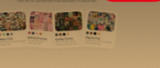
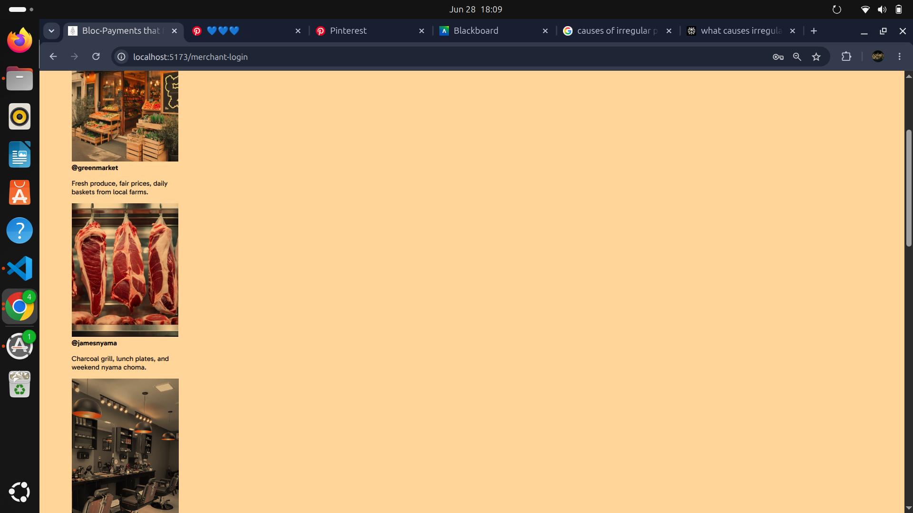

The following is a bunch of changes and additions I want us to make to this codebase

1. Signup page
- Add a touch of purple, just a slight touch of purple 
- Make the cards on that same page have different orientations at different degrees
- Rewrite the header to have only the relevant menu options in the codebase eg "login, "pay", "home"

2. Customer login

- This page is okay as it is but we need some configurations
- We have two image files that I want to sprinkle on this page as part of cards in the "src/assets/friends" and ".../friends_2"
- make the logo move to the left side of the header of the screen  

3. Merchant-login 
- On this page, arrange those cards beautifully they look so stupid right now. 

Backend routes in the "bloc/backend" folder

- We will use flask on the backend as our server(app.py)
- We will have the following models(tables): 

We will use postgresql(psql)

(a)customer_table
we will have:
* customer_id
* first_name
* last_name
* @handle
* email
* phone number
* password
* confirm password
PAGE: CUSTOMER HOMEPAGE
(b) customer-home

On the backend side, add the following functions:

- We will have the search bar capable of querying, finding and making suggestions automatically by finding merchants and customers from both the merchants and customers from the merchant_table and customer_table

(c) Have a customer_money table 

Here we will have the following columns in the db:
customer_id;
first_name;
last_name;
balance(updatable from last transactions);

(d) Send Money and Top Up will be wired later using the Mpesa Daraja API

(e) Your Feed

Here we will have the table:

* customer_id;
* first_name;
* last_name;
* recent_customer_searched;
* recent_merchant_searched;

then the recent customer(s) and recent merchant(s) paid are picked and displayed randomly on the frontend 

(f) recent transactions

* customer_id;
* recent_customer_paid;
* recent_merchant_paid;
* amount_paid_to_customer;
* amount_paid_to_merchant;

Here we will fetch the profile picture, profile bio, transactions, period money was received.

(g) The payments page i.e where you search for someone, enter an amount, add a little context

Here we have db table/fetch the following data:

* merchant_profile;
* customer_profile;
* amount_to_pay:
* encrypted_text_message to send to that phone number

Then the pay button triggers The payment to that user

(h) The Settings Page

- Here just wire in everything appropriately

Note the following:

1. The DB tables are probably more than I have said
2. Create the routes with the fetch and post functions appropriately
3. We still need to have some APIs such as cloudinary and the Mpesa APIs wired in a bit later so we will do that a bit later
4. In the backend folder, have a .env with psql passwords and APIs will be added
5. Have the Base URL(API_BASE_URL="localhost:3000") for now we will wire them later with a proper domain just make sure communication work perfectly with GET/POST requests
6. All pages should be mobile responsive
7. Now once you are done create a new "will_do_later.md" file that will tell me everything else I may need to wire in very briefly